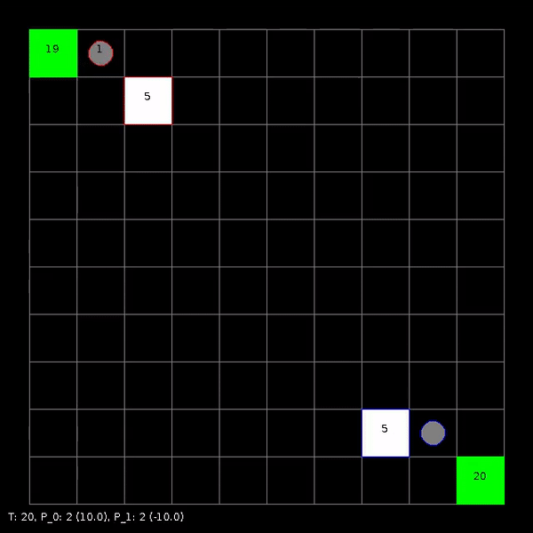
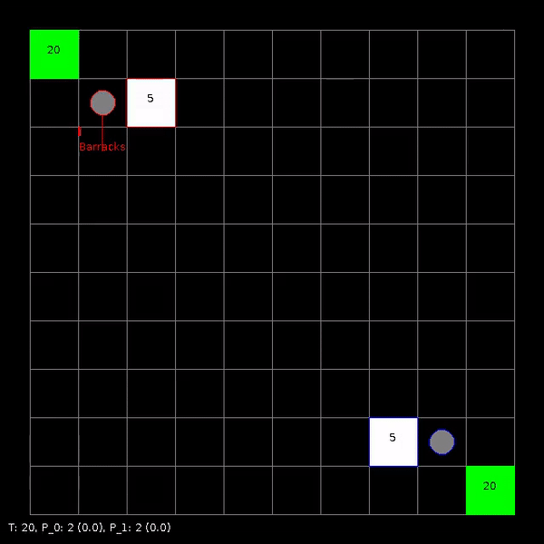

# Solving Sparse Reward Tasks with Action Guidance

This repo contains the source code of the paper *Solving Sparse Reward Tasks with Action Guidance*.


Benchmarked Learning Curves             |  Atari
:-------------------------:|:-------------------------:
Reward Shaping  |  Action Guidance
Learns to only produce combat units after the resources are exhausted  |  Leanrs to produce combat units and harvest resourced concurrently.
  |  

# Algorithms

Here is a description of related algorithms in this repo
* `ppo.py`
    * This is a pytorch implementation of PPO with common code-level optimizations
    found in openai/baselines. See https://costa.sh/blog-the-32-implementation-details-of-ppo.html for more details.
* `ppo_ac_positive_reward.py`
    * This is a PPO implementation that is augmented with our proposed approach *Action Guidance* with Positive Learning Optimization
* `ppo_positive_reward.py`
    * This is a PPO implementation that is augmented with Positive Learning Optimization

# Run Algorithms Locally

To run the experiments locally, please install `gym-microrts` first:

```bash
# install microrts, make sure you have jdk installed
rm ~/microrts -fR && mkdir ~/microrts && \
wget -O ~/microrts/microrts.zip http://microrts.s3.amazonaws.com/microrts/artifacts/202009041717.microrts.zip && \
unzip ~/microrts/microrts.zip -d ~/microrts/ && \
rm ~/microrts/microrts.zip

# install gym-microrts
git clone https://github.com/vwxyzjn/gym-microrts.git && \
cd gym-microrts && \
pip install dacite && \
pip install -e .

# install other requirements
pip install -r requirements.txt

# now you should be able to run `ppo_ac_positive_reward.py`!
python ppo_ac_positive_reward --capture-video
```

# Reproduce All of Our Experiments

Please run the following code to reproduce our results

```bash
bash generate_exp.sh
WANDB_KEY=${YOUR_WANDB_KEY} bash jobs.sh > docker.sh
```

You will find a `docker.sh` with docker run commands for all of our experiments
reported in the paper. Note that you should run only some of these `docker run` commands  
at a time to prevent them from exhausting your memory and CPU.

# Reproduce The Figures and Tables

To reproduce the figures and tables, try running

```bash
cd plots
WANDB_PROJECT=${YOUR_WANDB_PROJECT}
# run each command in plots.sh separately and
# check its printed latex table and generated figures
```

